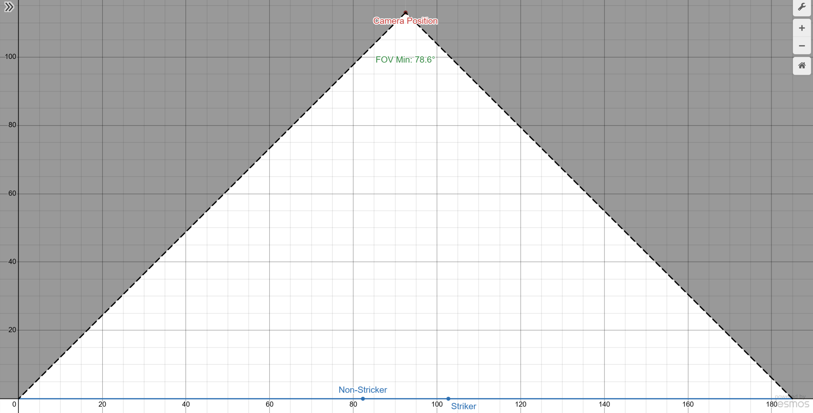

# Position:
Given a max ball velocity of approximately 170 km/h = 47 m/s and for maximum height a trajectory of 90 degrees (directly upwards) then maximum height attained is 

$h_m+\frac{V_0^2\sin^2(α)}{2g}=113m=370ft$ 

so we need to be hovering at approximately 113m, and a minimum field of view (FOV) of 80°

# Comparisons:
For the purpouse of these comparisons we are only looking at solutions compatibl with Raspberry pi using the CSI connector

### Raspberry Pi Camera Module 2

#### Specifications

 Sensor Resolution: 8MP  3280 x 2464
 Shutter: Global
 Lens mount: CS or M12
 Lens included(y/n): y / n
 FOV: Various
 Weight: 3g
 Compatibility: Modlels As and Bs, Raspberry Pi Zero, Pi 5, and, Pi 5 Compute Module

#### Benifits
#### Drawbacks
#### Link
https://www.raspberrypi.com/products/camera-module-v2/

### ArduCam 64MP Autofocus Camera

#### Specifications

 Sensor Resolution: 64MP 9152x6944
 Shutter: rolling
 Lens mount: M12
 Lens included(y/n): y (autofocus)
 FOV: 84º
 Weight: N/A
 Compatibility: Full Resolution Raspberry Pi Platforms (64MP):
Raspberry Pi 4B, 
Raspberry Pi Compute Module 4,   
Superpixel Resolution Raspberry Pi Platforms (16MP):
Raspberry Pi 2, 
Raspberry Pi 3, 
Raspberry Pi Compute Module 3, 
Raspberry Pi Zero W, 
Raspberry Pi Zero 2 W, 

#### Benifits
#### Drawbacks
#### Link
https://www.mouser.co.uk/ProductDetail/SparkFun/SEN-21276?qs=1Kr7Jg1SGW%252BjoxLJ2g9bSA%3D%3D
 https://www.sparkfun.com/arducam-64mp-autofocus-camera-module.html

### Raspberry Pi Camera module 3 Motorised Focus HQ Camera 

#### Specifications
 Sensor Resolution: 12.3MP,  4056 x 3040 pixels
 Shutter: rolling
 Lens mount: M12
 Lens included(y/n): y (autofocus)
 FOV: 75°
 Focus Distance: 80mm to infinity
 Weight: 5g
 Compatibility: Pi 4 Modlels As and Bs, Raspberry Pi Zero, Pi 5, and, Pi 5 Compute Module

#### Benifits

#### Drawbacks

#### Link
https://thepihut.com/products/arducam-motorized-focus-12mp-imx477-hq-camera-for-raspberry-pi
